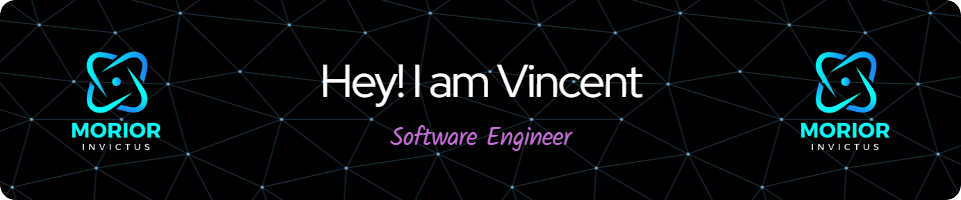

<h1 align="center">Hi 👋, I'm Vincent Cumayas</h1>
<h3 align="center">Data Scientist & Engineer from the Philippines | Building data-driven solutions and intelligent systems.</h3>

  

---

### 🔍 About Me

- 💡 **Data Scientist & Engineer** experienced in delivering end-to-end data and AI solutions—from scalable ETL pipelines to real-time analytics and ML-powered applications.
- 🧠 Built **AI/ML APIs** with Hugging Face and Langchain for product recommendation and chatbot systems.
- 🛠️ Skilled in **Python, BigQuery, MongoDB, Hugging Face, GCP, SQL, Docker, Apache Spark**, and more.
- 📊 Created interactive **Looker Studio dashboards** and integrated **Google Analytics** for performance optimization.
- 🤝 Passionate about mentoring, open-source, and creating impact with intelligent automation.

---

### 🧠 Core Skills & Technologies

**Languages**  
Python · SQL · JavaScript · Java · Bash

**Data Science & ML**  
Scikit-learn · TensorFlow · Pandas · Numpy · MLFlow · NLP · Hugging Face · Langchain · OpenCV · Matplotlib · Seaborn

**Data Engineering**  
BigQuery · MongoDB · PostgreSQL · Apache Spark · ETL Pipelines · Google Cloud Platform · Supabase · Prometheus · Grafana

**Tools & DevOps**  
Docker · Git · CI/CD · Looker Studio · Power BI · Google Apps Script

---

### 💼 Work Snapshot

**📊 A2K Group – Data Scientist & Modeling Analyst**  
*May 2024 – March 2025 | Philippines*

- Designed and deployed ML-powered APIs using Hugging Face and Sentence Transformers for personalized recommendations.
- Developed end-to-end **ETL pipelines (Medallion Architecture)** with MongoDB ↔ BigQuery integration.
- Led real-time data visualization via **Looker Studio dashboards** and monitoring with **Prometheus + Grafana**.
- Built chatbot systems using **Langchain + Gemini AI** and mentored interns on MLOps and data workflows.

---

### 🌐 Connect with Me

  
  

---

### 🧰 Languages & Tools

**Languages & Data**

  
  
  
  
  
  
  

**Frameworks & Libraries**

  
  
  
  
  

---

### 📈 GitHub Stats

  

  

  

